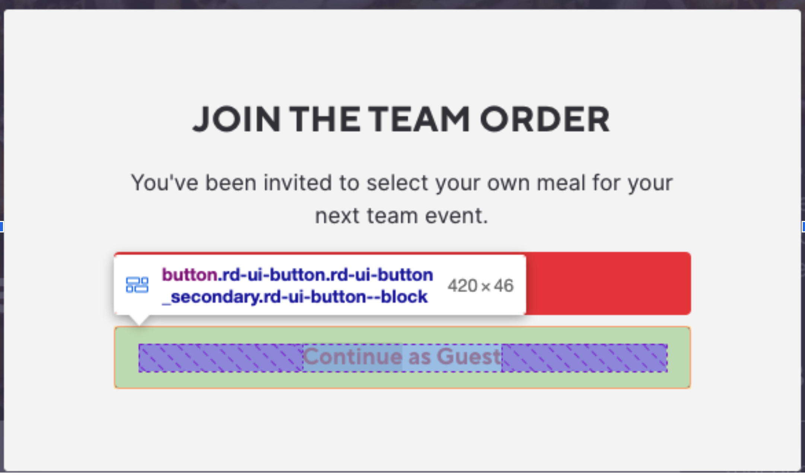
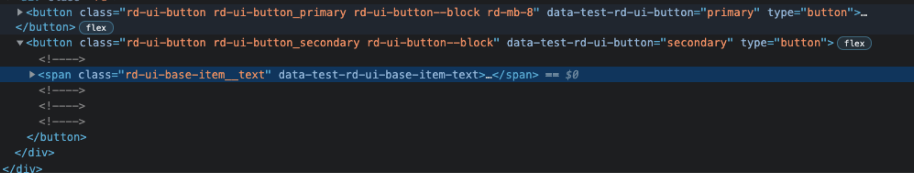

# Team Order Checkout Feature

Those is the team order check-out workflow:

* Checking in as a guest
* Provide Personal Details
* Order Food
* Checkout

You can access the feature live through this link:

[https://app-staging.food.ee/team-order/8lW9umVBhBBcTGor](https://app-staging.food.ee/team-order/8lW9umVBhBBcTGor)

## Objective

This project uses Cypress + Cucumber (gherkin) specs to verify a few of the key components of the checkout process against the link above. 

The feature to complete is included under [cypress/integration/TeamOrdering.feature](cypress/integration/TeamOrdering.feature). All steps for all scenarios can be find in this directory [cypress/integration/common](cypress/integration/common)

## Installation & Running The Tests

```bash
npm install
npm run cypress
```

## Data Test Selectors
We use data-test-selectors, they are present on all relevant elements, used them rather than classes/ids to select test elements. 

```javascript
cy.get('[data-test-rd-ui-button="primary"]').click();
cy.get('[data-test-ember-text-field]').fillIn('Some text');
```




## Resources
* [https://github.com/cypress-io/cypress](https://github.com/cypress-io/cypress)
* [https://github.com/TheBrainFamily/cypress-cucumber-preprocessor](https://github.com/TheBrainFamily/cypress-cucumber-preprocessor)
* [https://cucumber.io/](https://cucumber.io/)
* [https://github.com/simplabs/ember-test-selectors](https://github.com/simplabs/ember-test-selectors)

## Feature Specs
This spec is included in this repo under [cypress/integration/TeamOrdering.feature](cypress/integration/TeamOrdering.feature)

```gherkin
Feature: Team Ordering As Guest
 Scenario: Login as a guest
   Given I Navigate to "https://app-staging.food.ee/team-order/8lW9umVBhBBcTGor"
   When Presented with the sign in modal
   Then I am able to select guest or sign in
   And I am able to sign in as a guest

 Scenario: Providing user details
   Given I Navigate to "https://app-staging.food.ee/team-order/8lW9umVBhBBcTGor"
   When I sign select sign in as a guest
   Then I am presented with a details form that validates my inputs

 Scenario: Adding items
   Given I've signed in a guest
   When I select an item with no options
   Then That item is added to the cart

 Scenario: Budget Protection
   Given I've signed in a guest
   When I select multiple items with no options
   Then I am unable to exceed the budget

 Scenario: Selecting Options
   Given I've signed in a guest
   When I select an item with options
   Then I am able to select some modifications to the menu item

 Scenario: Checking out
   Given I've signed in a guest
   When I've finished ordering and checkout
   Then I am prompted for cutlery
   And I'm able to accept and finish the checkout process
```

